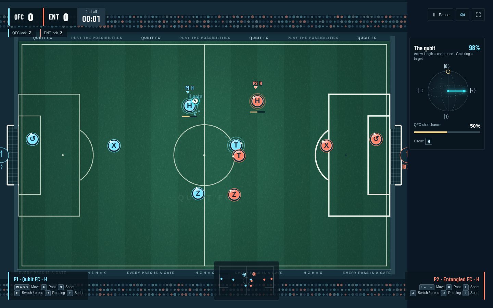

# Qubit FC

**[Play Qubit FC in your browser](https://edwardesmerson.github.io/isaqc-gamejam/)**

Six-a-side football. Every completed pass is a quantum gate.

Two teams, twelve players, one qubit. Build the ball's state through passing, protect it from pressure, and aim for the defending keeper's measurement lock. Football skill gets the shot past the keeper; the Born rule decides whether it counts.



## Play locally

Requires Node.js 20.19+ or 22.12+ and a modern desktop browser.

```sh
npm ci
npm run dev
```

Open **http://localhost:5173**. Choose **Kick off** for local multiplayer, **Practice vs AI** for one player, or **Watch match** for an autonomous demonstration. Keyboard layouts work immediately; two standard gamepads can claim teams in the join screen. Controllers use the browser's standard mapping, including Xbox and PlayStation controllers. Browsers generally reveal a connected controller after its first button press.

Standard matches have two three-minute halves. The showcase setting uses one-minute halves. Expert mode hides phase in the globe and ball hue; the shot probability and passing history remain visible. Audio begins after interaction. Pause with Escape, P, or controller Start; hiding the browser also pauses a live match.

| Action | Player 1 | Player 2 | Controller |
| --- | --- | --- | --- |
| Move / aim pass | W A S D | Arrow keys | Left stick / D-pad |
| Pass | F | K | A / Cross |
| Split through-ball | Q | O | LB / L1 |
| Hold, then release to shoot | G | L | B / Circle |
| Switch defender / press / split support | H | J | X / Square |
| Switch your keeper's reading | R | U | Y / Triangle |
| Sprint | Left Shift | Right Shift | RT / RB |

Pass in the direction you face; the preview identifies the best teammate and the scoring odds after that teammate's gate. It helps plan the circuit, while defenders and pressure can still change the outcome before reception. Control moves to the receiver. Your selected player has an arrow, a scoring probability bar, and a charging shot bar. Every team has six players: a keeper who resets the qubit, an X defender, H and Z midfielders, and S and S† attackers.

The split through-ball has a six-second cooldown. It sends two ghost lanes toward the best outfield receiver, with an alternate teammate as the other possible outlet. During the split, tap switch (H / J / controller X) to cycle eligible gate teammates, then move the selected player into either ghost lane. Gate players touching a lane change that lane's quantum evolution. A defender touching a ghost measures which path the ball takes; the defender either wins that path or the other lane survives. When both lanes reach the junction, interference decides which of two outlets receives the ball. Control automatically follows the real ball after path collapse or output selection.

## Quantum model

The ball is a Bloch vector **r**, including mixed states inside the unit sphere. The goal's target is unit vector **n**. The probability of scoring after beating the keeper is:

```text
P(goal) = (1 + r · n) / 2
```

For a pure state, this is exactly `cos²(theta/2)`. North against a north lock scores with certainty; south against that same lock never scores. The center gives 50% against every lock. Arrow length is **state strength**: the length of the Bloch vector, which distinguishes pure states from mixed states. It is not a general measure of quantum coherence; a full-length north or south state has no off-diagonal coherence in the Z basis.

Each net starts with a randomly selected target: `|0〉` (+Z), `|1〉` (−Z), `|+〉` (+X), or `|−〉` (−X). After every scored goal, the targets are selected again with the previous target excluded. Read the net glyph before building an attack.

- **X:** `(x, y, z) → (x, −y, −z)`.
- **H:** `(x, y, z) → (z, −y, x)`.
- **Z:** `(x, y, z) → (−x, −y, z)`.
- **S:** rotate about z by +π/2, a **+90° phase change**: `(x, y, z) → (−y, x, z)`.
- **S†:** the inverse −π/2 rotation: `(x, y, z) → (y, −x, z)`. S followed by S† restores any input state. Both leave north and south at their poles; phase gates matter when the state has transverse components.
- **Pressure:** a depolarizing channel continuously shortens r. Gates preserve length, so ordinary gate passes cannot repair it.
- **Turnover:** a projective Z measurement erases phase and returns north or south according to the current Born probability.
- **Keeper reception / kickoff:** reset to fresh north.
- **Keeper reading:** rotate between Z and X over two seconds while preserving the target's sign: `|0〉 ↔ |+〉` or `|1〉 ↔ |−〉`. Rotation pauses inside the defending penalty box. The globe's hollow gold marker and goal glyph show the current target, including partial rotations.
- **Shot:** physical contact and keeper saves occur first. A ball entering the goal then gets a half-second measurement beat. Success collapses to the target; rejection collapses to its opposite and rebounds into play. A failed measurement is not a keeper reset.
- **Split pass:** a separate path qubit is coupled to the ball qubit. Conditional lane gates, path measurements, and a final two-port interferometer operate on their joint density matrix. The probability of the two output ports sums to one; destructive interference at one outlet routes probability to the other.

Useful routes, starting from a fresh north state:

| Reception sequence | Result |
| --- | --- |
| H → Z → H | South, identical to X. Reveals how phase changes later outcomes. |
| H → S → S† | +X. S turns toward +Y, then S† restores the pre-S state. |
| H → S | +Y, giving 50% against either X or Z target. |
| S → H | +X. The same gates in a different order give a different result. |

Ordinary passes apply gates on reception; dribbling leaves the state unchanged. Intermediate teammates also count, so plan the entire passing route. X, H, Z, S, and S† are Clifford gates: ordinary passing from fresh north reaches only the six Pauli poles, so it cannot prepare the old 85.36% X/Z hedge. The quantum library retains verified T (+45°) math, but there is no T player.

Advanced split play can reach additional states: a conditional H on one lane followed by the bright-port outcome can produce `x = z = 1/√2` from north, before the receiving player's gate. That is an 85.36% hedge against the positive X/Z target pair. Conditional-H is a non-Clifford operation on the combined path–ball system; account for the receiver's gate before shooting.

**Gate drill** starts with an outfield player holding a fresh north ball and a fixed south `|1〉` goal target. Three passes follow H → Z → H; each receiver faces the next player, so repeated pass presses teach the circuit. A wrong gate restarts the setup. Shoot with the south state to complete the one-goal drill. Normal matches then restore randomly changing net targets.

## Build and checks

```sh
npm test
npm run build
npm run preview
```

The production build is in `dist/`. Serve it over HTTP with `npm run preview` or any static host. Quantum, simulation and input checks cover gate identities, the hedge, pressure conservation, completed passes, keeper saves/reset, interception collapse, board rebounds, shot outcomes, complete matches and independent input devices. With Python Playwright installed, run `python3 scripts/browser_check.py` while the development server is running to check the full UI and control flow. Screenshots go to `/tmp/qubit-fc-checks` by default; `QUBIT_FC_URL` and `QUBIT_FC_ARTIFACTS` override the URL and output directory.

## Source layout

| File | Responsibility |
| --- | --- |
| `src/game/quantum.js` | Bloch-vector gates, measurements, channels and path–ball density matrices |
| `src/game/simulation.js` | Fixed-step football, AI, match lifecycle and stats |
| `src/game/scene.js` | Procedural stadium, players, ball, camera, globe and radar |
| `src/input.js` | Two-player keyboard/gamepad controls, claims and input edges |
| `src/audio.js` | Synthesized kicks, gates, whistle, crowd and measurement feedback |
| `src/ui.js`, `src/style.css` | Title, join, instructions, broadcast HUD and results |
| `src/main.js` | Match orchestration and scene integration |

## Third-party declarations

- **Phaser 3.90**, MIT, game rendering and scene lifecycle.
- **Vite 7**, MIT, development server and production bundling.
- **Barlow Condensed**, SIL Open Font License, bundled via `@fontsource/barlow-condensed`.
- **Playwright**, Apache-2.0, optional development verification only; not a runtime dependency.

All primary gameplay code, pitch graphics, player/ball visuals, icons and synthesized audio are authored for this project. No external image or sound packs are used. Exact installed dependency versions are recorded in `package-lock.json`.

## Scope

The playable game includes local multiplayer, solo practice, spectator mode, the HZH gate drill, six-player formations, pass previews, gate passes, pressure, randomly changing signed goal targets, goalkeeper readings, collapse/reset, physical saves, measurement shots and rebounds, split through-balls with controllable gate support, two halves, stats, tutorials, audio and accessibility settings. Split passes use a separate spatial path state coupled to the ball qubit; their interference is not represented by a single Bloch arrow.

See [design notes](docs/DESIGN.md) for the model and visual direction, and [showcase guide](docs/SHOWCASE.md) for a short demonstration plan.
