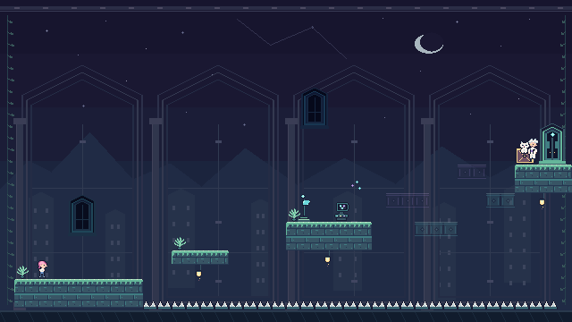

# ISAQC · QURIOSITY

The challenge brief is in [`about.md`](about.md). This Unity 6.6 project is an original pixel-art platformer demo: Fleabag, a small pink-haired kid in a white T-shirt and blue jeans, sets out to rescue Hilary from Schrödinger. The introductory room demonstrates a quantum choice between two safe routes and ends on a cliffhanger with Hilary still ahead; the editor builder also creates three editable graybox templates, not finished quantum levels.

## Visual preview



*Authored layout preview—not a Unity capture.*

## Open and play

1. Install Unity Editor `6000.6.4f1` with Unity Hub.
2. In Unity Hub, open the project at `unity/`. Wait for pinned packages to resolve and scripts to compile.
3. On first import, the editor creates missing demo assets additively if `Assets/Scenes/01-the-box.unity` is absent. A dirty current scene stays open and unsaved; the Console tells you to open `01-the-box.unity` when ready. With a clean current scene, the builder opens the new demo automatically.
4. Use **Quriosity > Build Demo and Level Templates** only if first-import setup failed or to fill in missing assets/scenes.
5. Open `Assets/Scenes/01-the-box.unity` and press **Play**. All four scenes, shared prefabs, tile assets, and the palette are included as ordinary editable Unity assets.

The room is framed as a fixed 640 × 360 view at 16 pixels per unit, with 16 × 16 environment tiles. See [`unity/README.md`](unity/README.md) for controls and editor setup, [`docs/level-building.md`](docs/level-building.md) for scene editing and level goals, and [`AGENTS.md`](AGENTS.md) for project guidance.

## Art and attribution

The current 32 demo PNGs are original pixel art authored by [`scripts/generate-demo-art.py`](scripts/generate-demo-art.py), not PixelLab output. Rebuild them with `python3 scripts/generate-demo-art.py`; see [`docs/art-pipeline.md`](docs/art-pipeline.md) for art replacement and PixelLab setup. OpenCode's MCP connection is configured in `opencode.json`; supply `PIXELLAB_API_KEY` and quit/restart OpenCode to load it. Library and asset provenance is recorded in [`THIRD_PARTY.md`](THIRD_PARTY.md).

## Team workflow

Read [`CONTRIBUTING.md`](CONTRIBUTING.md), then configure Git for this checkout with:

```bash
sh scripts/setup-git.sh
```

Use a task branch, commit small milestones, and merge directly into `main` after checking the change. Pull requests are not part of the hackathon workflow. GitHub checks whitespace on pushes.

Before committing, run:

```bash
git diff --check
git diff --cached --check
```

The builder adds its four scenes to Build Settings. Use Unity’s **File > Build Profiles** to make a local player. `Quriosity > Verify Saved Demo Assets` checks the saved scaffold, but still play through the demo—especially both measured routes—in Unity. No command-line player-build workflow is configured.
